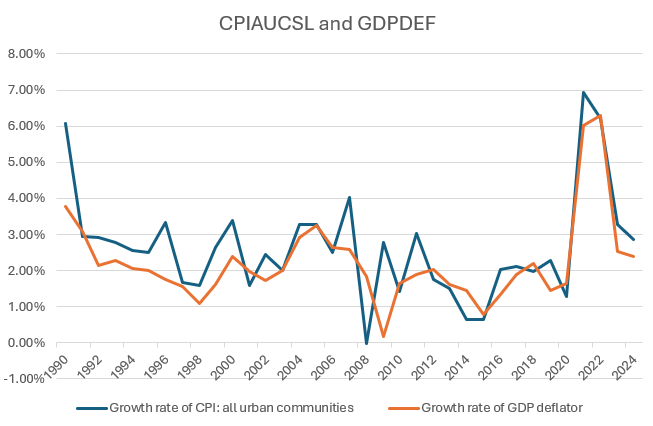
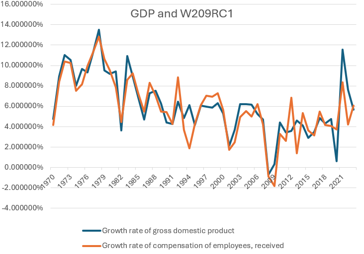
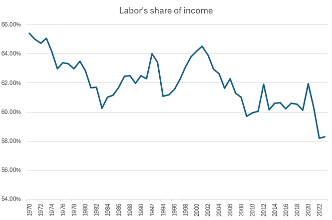

# Problem Set 1

Ishan Pranav

February 11, 2025

Professor Pricila Maziero

ECON 11 Economics of Global Business

## Definitions

Let $X$ be a continuous variable. Then $\gamma_X$ denotes its growth rate for a
given period with $\gamma_X=\ln(X_1)-\ln(X_0)$, where $X_1$ and $X_0$ denote the
values of $X$.

## Question 1

> Suppose an economy produces aluminum, microchips and computers. The aluminum
> industry produces $320,000 in revenue, spends $60,000 on microchips, $55,000
> on computers, pays workers $95,000. The microchip industry produces $220,000
> in revenue, spends $60,000 on aluminum, $35,000 on computers and pays workers
> $90,000. The computer industry produces $190,000 in revenue, spends $60,000 on
> microchips, $55,000 on aluminum and pays workers $60,000. There is no
> government. Calculate gross domestic product (GDP) using the production and
> income approaches.

| Agent | Revenue ($ thousand) | Material cost ($ thousand) | Value added ($ thousand) | Labor cost ($ thousand) | Profit ($ thousand) |
|---|--:|--:|--:|--:|--:|
| Aluminum industry | $320$ | $60+55=115$ | $205$ | $95$ | $110$ |
| Microchip industry | $220$ | $60+35=95$ | $125$ | $90$ | $35$ |
| Computer industry | $190$ | $60+55=115$ | $75$ | $60$ | $15$ |
| __Total__ | $730$ | $325$ | $405$ | $245$ | $160$ |

__Production approach.__

We can measure GDP by computing the "value added" at each
step of production.

The value added by an industry is given by its revenue minus its material costs.
Summing the "value added" over all industries gives $405,000.

Thus, the GDP via the production approach is $405,000.

__Income approach.__

We can instead measure GDP by computing the total payments to
labor and capital.

An industry's payments to labor are given by its labor cost. The sum over all
industries is $245,000.

In this economy, profits account for the remainder of the income. An industry's
profits are given by its revenue minus its material and labor costs. Summing the
profits over all industries gives $160,000.

Together, the sum of income from labor and income from profits is $405,000.
Thus, the GDP via the income approach is also $405,000.

## Question 2

> Consider an economy that produces only two types of goods: apples and bananas.
> The production and price for the base year and the current year are as
> follows.

| Product | Base quantity (bags) | Base price ($/bag) | Current quantity (bags) | Current price ($/bag) |
|---|--:|--:|--:|--:|
| Apple | 10 | 2.00 | 12 | 2.50 |
| Banana | 18 | 1.00 | 22 | 1.50 |

Let $\rm{A}$ denote apples and $\rm{B}$ denote bananas. Let $p_x$ (respectively,
$q_x$) denote the price (respectively, quantity) of product $x$ in the current
year. Let ${p_x}_0$ (respectively, ${q_x}_0$) denote the price (respectively,
quantity) of product $x$ in the base year.

### Question 2 Part A

> Compute nominal gross domestic product (GDP) in the current year and in the
> base year. What is the percentage increase since the base year?

Let $Y'$ (respectively, $Y_0$) denote nominal GDP in the current year
(respectively, base year).

__Current year.__

By definition, nominal GDP is a measure of _output_, and is given by the
sum-product of prices and quantities.

$$\begin{align*}Y'
&=\sum_{x\in\{\rm{A},\rm{B}\}}{(p_x\cdot q_x)}\\
&=\left(\frac{\$2.50}{\rm bag}\times 12~\text{bags}\right)+\left(\frac{\$1.50}{\rm bag}\times 22~\text{bags}\right)\\
&=\$63.00.\end{align*}$$

The nominal GDP in the current year is $63.

__Base year.__

$$\begin{align*}Y_0
&=\sum_{x\in\{\rm{A},\rm{B}\}}{({p_x}_0\cdot{q_x}_0)}\\
&=\left(\frac{\$2.00}{\rm bag}\times 10~\text{bags}\right)+\left(\frac{\$1.00}{\rm bag}\times 18~\text{bags}\right)\\
&=\$38.00.\end{align*}$$

The nominal GDP in the base year was $38.

__Percentage increase.__

$$\frac{Y'}{Y_0}-1\approx 65.7895\dots\%.$$

$$\gamma_{Y'}=\ln(Y')-\ln(Y_0)\approx 50.5549\dots\%.$$

The increase since the base year is approximately 66 percent, or 51 percent
in a continuous model.

### Question 2 Part B

> Compute real gross domestic product (GDP) in the current year and in the base
> year. By what percentage does real GDP increase from the base year to the
> current year?

Let $Y$ denote real GDP in the current year.

__Current year.__

By definition, real GDP controls for variations in price by fixing prices to
that of the base year.

$$\begin{align*}Y
&=\sum_{x\in\{\rm{A},\rm{B}\}}{({p_x}_0\cdot q_x)}\\
&=\left(\frac{\$2.00}{\rm bag}\times 12~\text{bags}\right)+\left(\frac{\$1.00}{\rm bag}\times 22~\text{bags}\right)\\
&=\$46.00.\end{align*}$$

The real GDP in the current year is $46.

__Base year.__

Intuitively, $Y_0$ also represents real GDP in the base year. In the base year,
real GDP and nominal GDP are both equal to the sum-product of base-year prices
and base-year quantities.

So the real GDP in the base year is $38.

__Percentage increase.__

$$\frac{Y}{Y_0}-1\approx 21.0526\dots\%.$$

$$\gamma_Y=\ln(Y)-\ln(Y_0)\approx 19.1055\dots\%.$$

The increase since the base year is approximately 21 percent, or 19 percent
in a continuous model.

### Question 2 Part C

> Calculate the consumer price index (CPI) in both years and the inflation rate
> using the CPI.

__Axiom.__

Assume that the expenditure base to compute the CPI is base-year quantities
(${q_{\rm A}}_0$ and ${q_{\rm B}}_0$).

Let $P$ denote the CPI in the current year.

__Current year.__

By definition, the CPI controls for variations in quantity by fixing quantities
to the expenditure base (base-year quantities per our axiom).

$$\begin{align*}P
&=\sum_{x\in\{\rm{A},\rm{B}\}}{(p_x\cdot{q_x}_0)}\\
&=\left(\frac{\$2.50}{\rm bag}\times 10~\text{bags}\right)+\left(\frac{\$1.50}{\rm bag}\times 18~\text{bags}\right)\\
&=\$52.00.\end{align*}$$

The CPI in the current year is $52.

__Base year.__

Intuitively, $P_0=Y_0$ also represents the CPI in the base year. Per our axiom,
quantity produced and quantity expended are equal. In the base year, nominal GDP
and CPI are both equal to the sum-product of base-year prices and base-year
quantities.

So the CPI in the base year is $38.

__Inflation rate.__

$$\frac{P}{P_0}-1\approx 36.8421\dots\%.$$

$$\gamma_P=\ln(P)-\ln(P_0)\approx 31.3658\dots\%.$$

The inflation rate since the base year is approximately 37 percent, or 31
percent in a continuous model.

## Question 3

The following notes apply to all data in Question 3 and Question 4.

* Growth rates are continuous.
* Although the time series begins in 1990, data from 1989 are used to compute
  the growth rate for 1990.
* The number of significant figures is determined by the data.
* The periodicity is annual with end-of-period aggregation.

### Question 3 Part A

We will use the consumer price index (CPI): all urban consumers
([CPIAUCSL](https://fred.stlouisfed.org/series/CPIAUCSL)) from the U.S. Bureau
of Labor Statistics and the gross domestic product (GDP) deflator
([GDPDEF](https://fred.stlouisfed.org/series/GDPDEF/)) from the U.S. Bureau of
Economic Analysis, both available from FRED, the Federal Reserve Bank of St.
Louis.

### Question 3 Part B

__Annual growth rates of consumer price index (CPI) and gross domestic product (GDP) deflator indices.__

| Variable | 1990–2000 | 2000–2010 | 2010–2020 | 2010–2024 | 1990–2024 |
|----------|----------:|----------:|----------:|----------:|----------:|
| Growth rate of CPI: all urban consumers ([CPIAUCSL](https://fred.stlouisfed.org/series/CPIAUCSL)) | 2.632% | 2.333% | 1.726% | 4.817% | __2.534%__ |
| Growth rate of GDP deflator ([GDPDEF](https://fred.stlouisfed.org/series/GDPDEF/)) | 1.9980% | 2.0767% | 1.6300% | 4.3070% | __2.1846%__ |

### Question 3 Part C

> Discuss how inflation has evolved in the U.S. in the last decades. In
> particular, what happened to inflation during the 1990s? What about the
> financial crisis in 2007–2009? What was the impact of the pandemic on
> inflation?

During the 1990s, inflation fell steeply from its 1989 level and continued
falling throughout the decade.

During the financial crisis of 2007–2009, inflation fell steeply from its 2006
level and the economy briefly fell into disinflation, with an inflation rate
slightly below zero.

During the pandemic, inflation rose steeply from its 2020 level and, in 2021 and
2022, the economy experienced the highest level of inflation since 1990. This
was likely due to enhanced government borrowing and economic stimulus. By 2024,
inflation had fallen, returning to normal levels.

### Question 3 Part D

> Suppose you graduated from New York University in 1989 and your nominal wage
> would increase by the inflation computed by one of these price indexes. Which
> price index would you choose? Explain.

Based on these data, I would choose the CPI, since it consistently overestimates
inflation for the years in our sample. In terms of inflation, it appears that
costs of living, as proxied by the CPI, rise faster than domestic output (GDP).

### Question 3 Part E

> Discuss one of the differences between the gross domestic product (GDP) price
> deflator and the consumer price index (CPI).

The GDP deflator is based on a measure of production, which includes a broad
range of products and services. Meanwhile, the CPI restricts its scope to
products and services that are consumed. Whereas GDP uses actual quantities
produced and reflects a changing product mix, CPI uses an expenditure base and
represents a fixed "basket" of goods.

## Question 4

### Question 4 Part A

We will use the gross domestic product
([GDP](https://fred.stlouisfed.org/series/GDP)) and the compensation of
employees, received, ([W209RC1](https://fred.stlouisfed.org/series/W209RC1/)),
both from the U.S. Bureau of Economic Analysis and available from FRED, the
Federal Reserve Bank of St. Louis.

__Annual growth rates of gross domestic product (GDP) and compensation of employees, received.__

| Variable | 1970–1980 | 1980–1990 | 1990–2000 | 2000–2010 | 2010–2020 | 2020–2023 | 1970–2023 |
|---|--:|--:|--:|--:|--:|--:|--:|
| Growth rate of GDP ([GDP](https://fred.stlouisfed.org/series/GDP)) | 10.08887% | 6.98762% | 5.52689% | 3.83235% | 3.65691% | 8.28638% | 6.14690% |
| Growth rate of compensation of employees, received ([W209RC1](https://fred.stlouisfed.org/series/W209RC1/)) | 9.886% | 6.903% | 5.589% | 3.057% | 4.029% | 6.206% | 5.911% |

__Interpretation.__

Before 1990, the growth rates of GDP and employee compensation appear to be
extremely similar. After 1990, the growth rate of GDP is consistently higher
than that of employee compensation.

The marginal product of labor reflects labor demand, so its growth rate is
linked to that of compensation. Output per worker tends to grow at a similar
rate, although the correlation has weakened in recent decades. Of course, the
growth rate of output per worker is linked to that of GDP, and, holding the
number of workers constant, their growth rates are the same.

The strong-but-weakening relationships between GDP and employee compensation and
between marginal product of labor and output per worker are likely driven by the
same underlying factors.

If, as assumed by the Cobb–Douglas model, the allocation of income to labor and
capital is constant, then GDP and compensation of employees should grow at the
same rate. Empirically, however, they do not, and Part B suggests that the
assumption may not hold in practice.

One explanation is that the economy is substituting some types of labor for
capital via automation. If this is true, the simpler Cobb–Douglas production
function does not capture this effect over time: A more robust model is
required.

### Question 4 Part B

We will use proprietors' income with inventory valuation and capital consumption
adjustments, nonfarm
([A045RC1A027NBEA](https://fred.stlouisfed.org/series/A045RC1A027NBEA)), and
farm ([B042RC1A027NBEA](https://fred.stlouisfed.org/series/B042RC1A027NBEA)),
both from the U.S. Bureau of Economic Analysis and available from FRED, the
Federal Reserve Bank of St. Louis.

__Axiom.__

Assume that labor income is the sum of: compensation of employees, received;
proprietors' income with inventory valuation and capital consumption
adjustments, nonfarm; and farm. Thus, "labor's share of income" is the sum of
these three variables, divided by GDP.

__Interpretation.__

* There appears to be a positive correlation between labor's share of income and
  the variables in Part A.
* Labor's share of income has experienced a falling trend since 1970, suggesting
  that the share of income attributed to other factors of production (that is,
  capital) has increased since 1970. However, capital's share of income remains
  the minority as labor's share has been the majority since 1970.
* It may not be appropriate to attribute 100% of proprietor's income as a
  payment to labor, since proprietors are entitled to a share of the company's
  profits. Relative to that of other employees, a proprietor's  income is likely
  more dependent on company performance, and more attributable to capital owned
  by the proprietor.
* The falling trend in labor's share of income aligns with rising income
  inequality. As capital accounts for more income, more productivity, and thus
  wealth, is concentrated under the control of the owning class. Meanwhile,
  low-income and low-skill laborers see declines in relative compensation and
  may be replaced by improvements in technology and capital.
* Before the COVID-19 pandemic, labor's share of income experienced an
  increasing trend. However, during the pandemic, labor's share of income fell
  to its lowest level since 1970. Shutdowns, layoffs, and unemployment are
  likely responsible.
